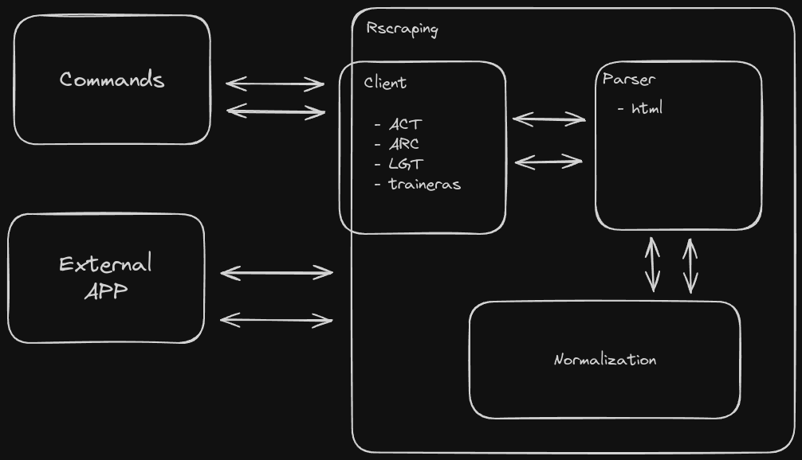

# Architecture



# Commands

## Find Race

Tries to find the race information searching in the leagues webpages.

```sh
python scripts/findrace.py <datasource> <race_id> <options>
    # --table=<int>: Tells the parser the day of the race we want (for multi-race pages).
    # --female=<bool>: Specifies if we need to search in the female pages.
    # --save=<bool>: Saves the output to a csv file.

python findrace.py act 1678276379 --female
```

# Utils

## Download Images

Downloads images for a given rower in a given club (Only supports traineras.es).

```sh
python scripts/downloadimages.py <rower_id> <club_name> <options>
    # --year=<str>: Year searched.
    # --output=<str>: Folder where images will be uploaded.

python downloadimages.py 2914 'PUEBLA' --year=2019 --output=out
```

## Lemmatize

Create a list of lemmas for the given phrase.

```sh
python scripts/lemmatize.py <phrase>
```
